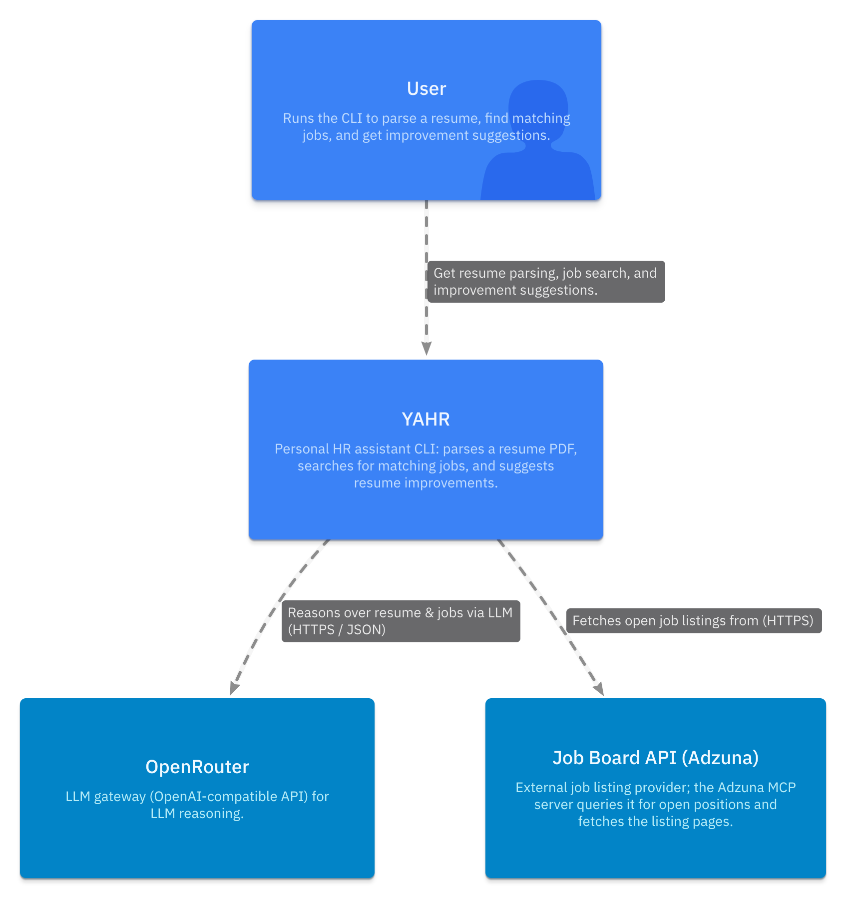
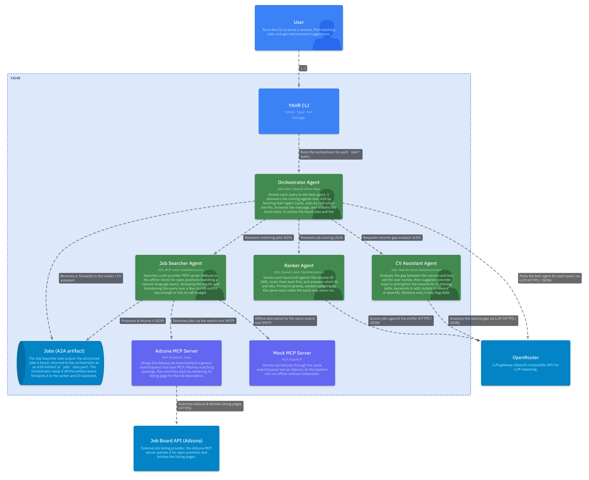
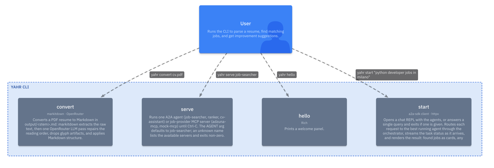
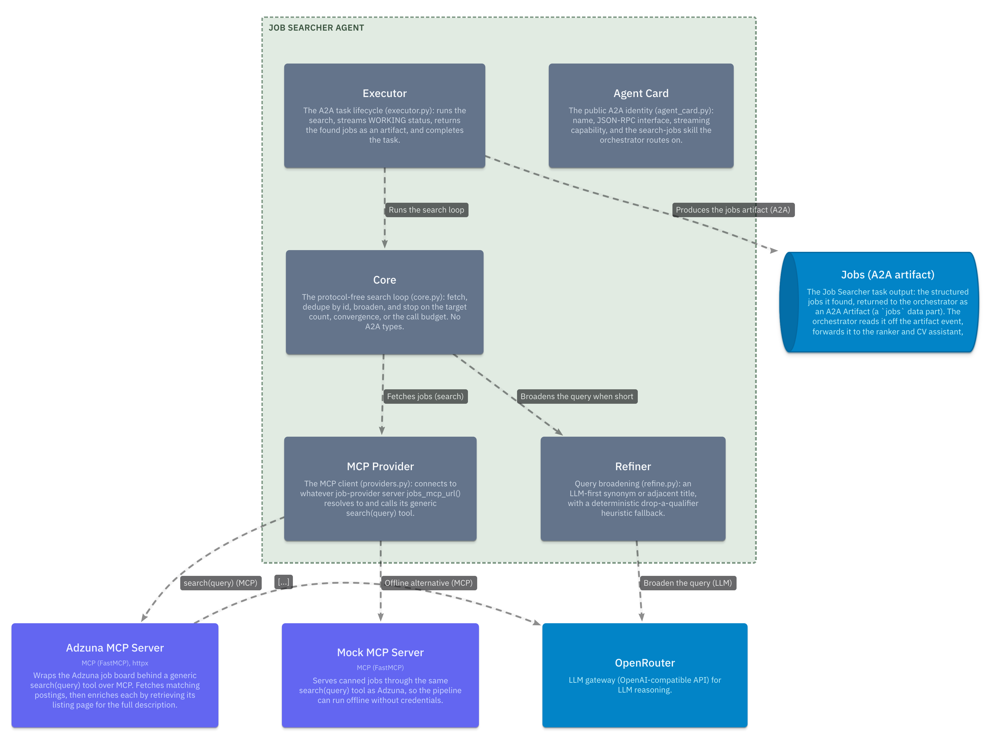
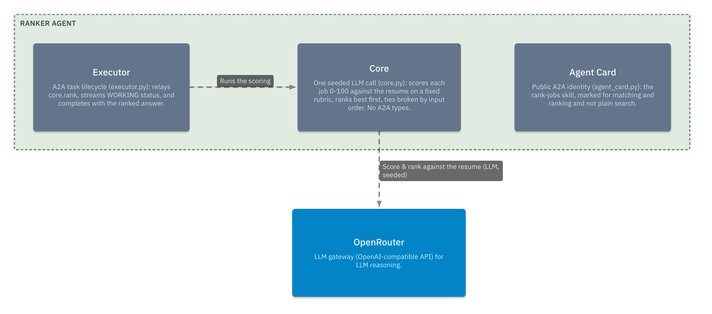
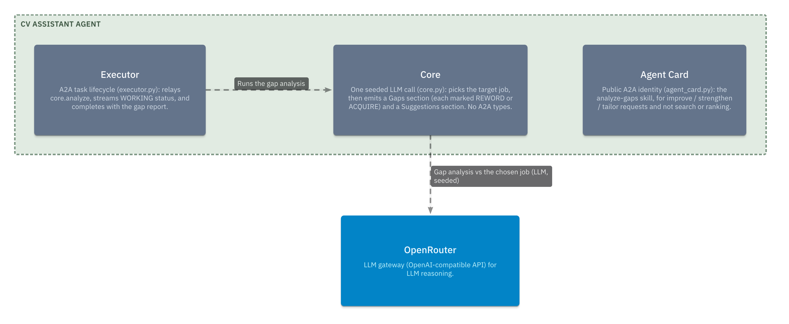
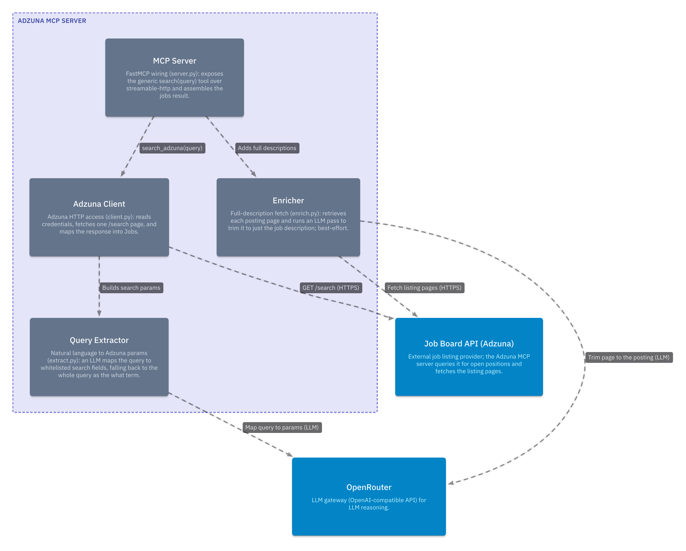
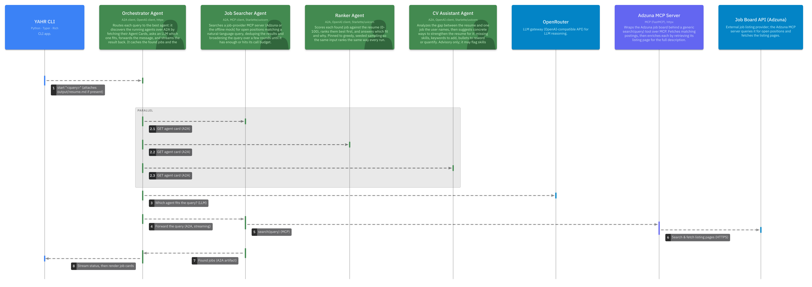
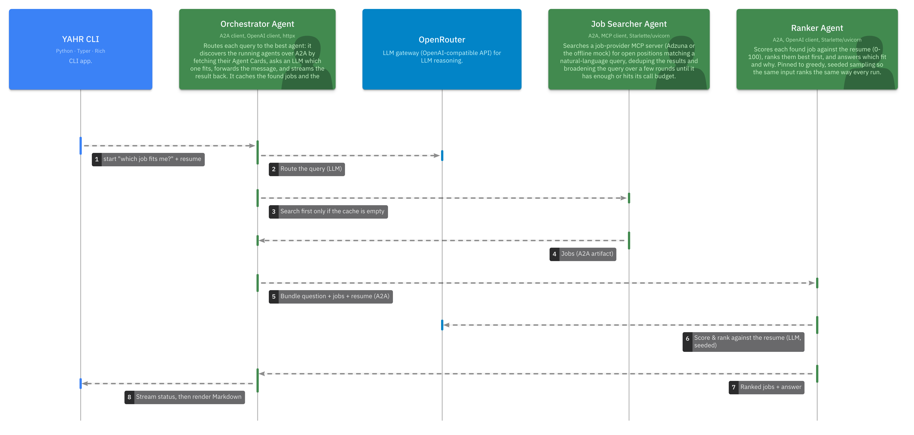
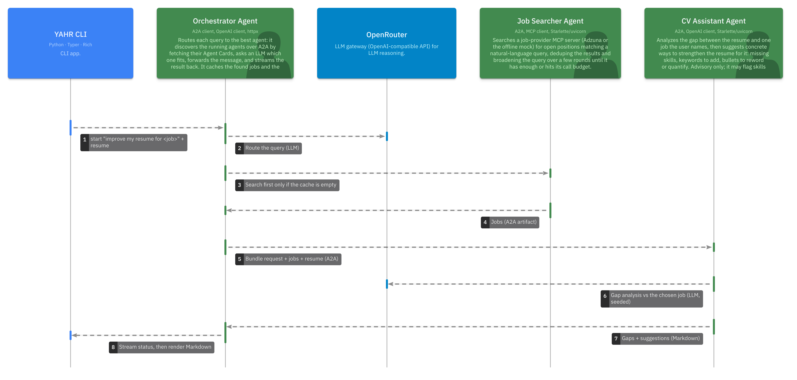

## Design

YAHR is built on A2A (Agent-to-Agent), an open protocol that lets independent agents talk to each other over HTTP. The work is split across one orchestrator and three specialized agents, each running as its own A2A server on its own port and doing a single job. The orchestrator sits in front of all three, routing each request to the agent that fits and streaming the result back to the terminal.

The agents know nothing about each other or about the orchestrator. An agent answers A2A requests and returns a result, and that is all. This is what keeps the system loosely coupled. A new agent comes online by starting its server and serving an agent card, and the orchestrator finds it the next time it looks; nothing else has to change. The job boards sit one layer further out, behind MCP (Model Context Protocol), which keeps the job providers swappable too.

Two choices run through every agent. The first is that each agent keeps its protocol layer apart from its work: a thin executor drives the A2A task while a protocol-free core does the actual searching, scoring, or analysis. No A2A type reaches the core, so the core runs and can be checked offline without a server. The second is that the agents that reason over the resume, the Ranker and the CV Assistant, are pinned to greedy, seeded sampling (temperature 0 and a fixed seed) so the same input produces the same output from one run to the next. The orchestrator's routing call is pinned the same way, so a given query routes to the same agent every time. This determinism is best effort: it holds only as far as the model provider honors the seed.

### System Context

At its outermost level YAHR is one system the candidate runs locally, and it depends on two outside services.

The only actor is the User. The candidate runs the CLI to parse a resume, search for matching jobs, and get suggestions for improving it, and every result comes back through that one program on their own machine.

YAHR itself reaches out to two external systems. It calls OpenRouter, an LLM gateway with an OpenAI-compatible API, whenever it has to reason over the resume or the jobs, over HTTPS as JSON. It calls the Adzuna job board API for the open listings themselves, also over HTTPS. OpenRouter covers all the model reasoning; Adzuna is where the actual postings come from. How that work is divided inside YAHR is what the rest of the Design section covers.

### Container Diagram

Inside YAHR the work splits into a handful of containers. The candidate starts only the CLI; every other container is a server reached over the network, except the orchestrator, which runs in-process inside the CLI rather than on a port of its own yet.

The orchestrator is the hub of the system. It fans out to three A2A agents, each its own server on its own port: the Job Searcher, the Ranker, and the CV Assistant. It also calls OpenRouter, the external LLM gateway, to pick which agent should handle each query.

OpenRouter is the LLM gateway used for every reasoning step.

The three agents differ in how far they reach. The Ranker and the CV Assistant are self-contained: each answers the orchestrator by calling OpenRouter, and touches nothing else. The Job Searcher is the only agent that goes after job listings, and it does so as an MCP client rather than calling a board directly. Behind it sit two MCP job servers that expose the same search tool, the Adzuna server and the offline mock, and only the Adzuna server reaches the external job board API.

One container is data rather than a process: the jobs artifact. The Job Searcher produces it as the structured output of its A2A task, and the orchestrator receives it, passes it to the CLI to render, and keeps it so the Ranker and the CV Assistant can reuse it without a fresh search.

The two MCP servers are deliberately outside the agent roster. They are MCP servers, not A2A agents, so the orchestrator never discovers them and never routes a query to them; the Job Searcher is the only thing that reaches them.

#### CLI Architecture

The CLI is a Typer application that renders with Rich, and it exposes four commands. `convert` turns a resume PDF into the Markdown profile: markitdown extracts the raw text, then one LLM pass repairs the reading order and applies Markdown structure. `serve` runs one server until interrupted, either an A2A agent (`job-searcher`, `ranker`, `cv-assistant`) or a job-provider MCP server (`adzuna-mcp`, `mock-mcp`). `start` is the main command: given a query it answers once and exits, and with no query it opens a chat REPL. `hello` just checks that the CLI is installed.

The orchestrator runs in-process inside `start`; a standalone one on its own port is planned but not yet built, and its port is already reserved. For each request, `start` reads the resume file if it is there, passes the query and resume to the orchestrator, and renders what streams back: found jobs as boxed cards, any other agent reply as Markdown, and the intermediate status lines as the agent works. In the REPL those caches carry across turns, so a search, a "which of these fits me?" question, and a "what should I fix for the Acme role?" question become one conversation instead of three from-scratch runs.

Agent names and addresses live in one place, the roster, and both the running servers and the orchestrator's discovery list derive from it. A name or a port cannot drift between the agent that advertises it and the orchestrator that looks for it.

#### Job Searcher Agent

The Job Searcher turns a natural-language query into a list of open positions. It never calls a job board directly. It connects to whatever MCP server its configured URL points at and calls that server's generic `search` tool, so Adzuna, the bundled mock, or any future source is just a different URL.

The search is a goal-seeking loop, not a single call. It fetches jobs for the query, dedupes them by id into a running set, and checks whether it has enough. If not, it broadens the query and searches again. Broadening is LLM-first: the model offers a synonym, an adjacent title, or a wider location within the same country, while keeping the constraints the candidate stated. If the model is unreachable or returns junk, a deterministic fallback drops one qualifier (such as "senior") or the trailing word, so the loop always moves forward. It stops on the first of three conditions: it has as many jobs as the query asked for (a "find 3 jobs" count, or a default of five), the query can no longer be broadened and has converged, or it hits its budget of search rounds and fetch calls. The budget exists because the real provider is a paid, rate-limited API.

The result leaves the agent in two forms. The structured jobs go out as the `jobs` artifact. The same jobs, rendered as Markdown, are the readable result the CLI shows and the Ranker later reads.

#### Ranker Agent

The Ranker scores the found jobs against the resume and answers the candidate's question in a single LLM call. The orchestrator bundles three things into that call: the question, the jobs, and the resume. The prompt fixes the Fit rubric so the scoring stays consistent: each job gets a score from 0 to 100, the list is ranked best first, and ties break by the order the jobs arrived in, never at random. The Ranker judges only from the text it is given, so a requirement the resume does not mention counts as not met rather than a guess.

#### CV Assistant Agent

The CV Assistant takes one job the candidate names and reports how to strengthen the resume for it. As with the Ranker, it works from a bundle of the request, the jobs, and the resume in a single LLM call. It first picks the single target job by matching the title or company in the request against the postings, and falls back to the first posting when the request names none. Then it writes two sections: a Gaps section listing what the posting asks for that the resume does not clearly show, and a Suggestions section of concrete edits.

Each gap is marked REWORD, when the resume already states the fact and only needs better wording, or ACQUIRE, when it is genuinely missing. The agent stays advisory: it may flag skills the resume lacks, but it never rewrites the resume, and it credits the candidate with a strength only when that fact is actually written in the resume.

#### Adzuna MCP Server

The Adzuna MCP server is the one place that talks to the real job board. It exposes the same generic `search(query) -> {"jobs": [...]}` tool the mock does, so the Job Searcher cannot tell the two apart; everything specific to Adzuna is sealed inside this server. It runs over streamable HTTP and binds its port from the roster, the same source the Job Searcher reads its URL from, so the address written once is the address both ends use.

Four modules split the work, and only two of them reach off the machine. The MCP Server (`server.py`) is thin wiring: it advertises the `search` tool and assembles the result, delegating everything else. The Adzuna Client (`client.py`) is the only module that calls the job board, fetching one `/search` page over HTTPS with credentials read from the environment and mapping the response into Jobs, skipping any entry missing the id it needs to dedupe or the title it needs to show. The Query Extractor (`extract.py`) turns the candidate's natural-language query into Adzuna's whitelisted search fields with an LLM pass, falling back to the whole query as the plain `what` term when the model is unreachable or returns nothing usable. The Enricher (`enrich.py`) exists because Adzuna's search results carry only a truncated description: it fetches each posting's own page and runs an LLM pass to trim it down to just the job description.

Both LLM steps lean on OpenRouter, the same gateway the agents use, and both are best effort by design. If the extractor's model call fails the search still runs on the raw query, and if a posting page cannot be fetched or trimmed the job keeps its truncated description rather than dropping out. This keeps the credentials and the paid API entirely behind the MCP boundary: the Job Searcher, and everything above it, only ever see the provider-agnostic `search` tool.

### Sequence Diagram

The three commands the candidate runs all follow the same skeleton: the CLI hands the query and resume to the in-process orchestrator, the orchestrator discovers the running agents and asks the LLM which one fits, forwards the work, and streams the result back to render. What changes between them is which agent the router picks and how much work is fresh versus reused from the jobs cache. The flows below trace each one end to end.

#### Job Searcher Flow

A plain search starts fresh. The CLI calls `start` with the query, attaching `output/resume.md` if it is there. The orchestrator first fetches every agent's card in parallel to learn who is up, then asks OpenRouter which agent fits and, for a search, gets the Job Searcher. It forwards the query over a streaming A2A call; the Job Searcher runs its `search(query)` MCP tool against the Adzuna server, which searches and fetches listing pages over HTTPS. The found jobs come back as an A2A artifact, and the orchestrator streams the status lines and then renders the job cards in the terminal. This run is what fills the jobs cache the next two flows reuse.

#### Ranking Flow

A ranking query reuses what the search already found. The CLI sends "which job fits me?" with the resume, and the orchestrator routes it to the Ranker. Rather than search again, it reads the jobs it cached on the earlier `start` run, calling the Job Searcher here only when the cache is empty. It then bundles the question, those jobs, and the resume into one A2A message to the Ranker, which scores and ranks them against the resume in a single seeded LLM call. The ranked jobs and the written answer stream back and render as Markdown.

#### Improve Flow

The resume-improvement query has the same shape, with the CV Assistant in the Ranker's place. The CLI sends "improve my resume for &lt;job&gt;" with the resume, and the orchestrator routes to the CV Assistant, again reusing the cached jobs and searching first only if the cache is empty. It bundles the request, the jobs, and the resume, and the CV Assistant makes one seeded LLM call that picks the single named job, compares it against the resume, and emits a Gaps section (each gap marked REWORD or ACQUIRE) and a Suggestions section. There is no automatic rewrite loop: the advice streams back as Markdown and the candidate makes the edits.

