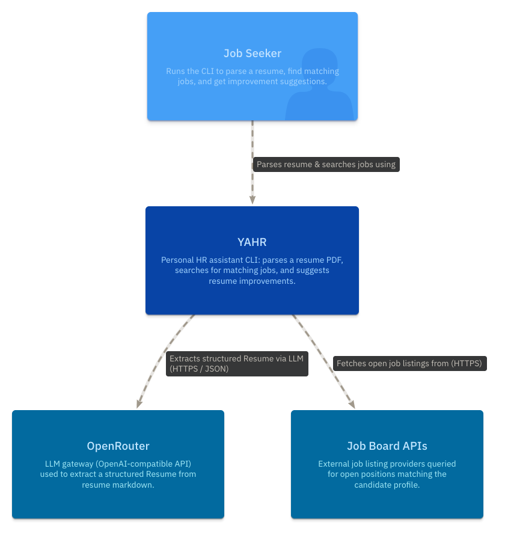

# YAHR

    
Elvis Perlika

elvis.perlika@studio.unibo.it

# Abstract

YAHR (Yet Another HR) is a command-line career co-pilot that automates the
job-search workflow end to end. Starting from a resume in PDF form, it
converts the document to a structured profile, searches for relevant open
positions, scores each listing against the candidate's background, and
returns concrete suggestions for improving the resume to maximize the
chances of landing an interview — all from the terminal.

The system is built on the A2A (Agent-to-Agent) protocol, an open standard
for inter-agent communication, and is organized as a set of specialized
agents coordinated by a single orchestrator: a Resume Builder that parses the
CV into a structured representation, a Job Searcher that queries external
APIs for openings, a Ranker that matches and scores those openings against
the profile, and a CV Assistant that identifies gaps and proposes targeted
improvements. This report describes the motivation, architecture, and
implementation of YAHR, with particular attention to how the A2A protocol
enables a modular, loosely coupled multi-agent design.

# Domain

# Design

# Tech Stack

# Code

# Testing

# Deployment

# Conclusion