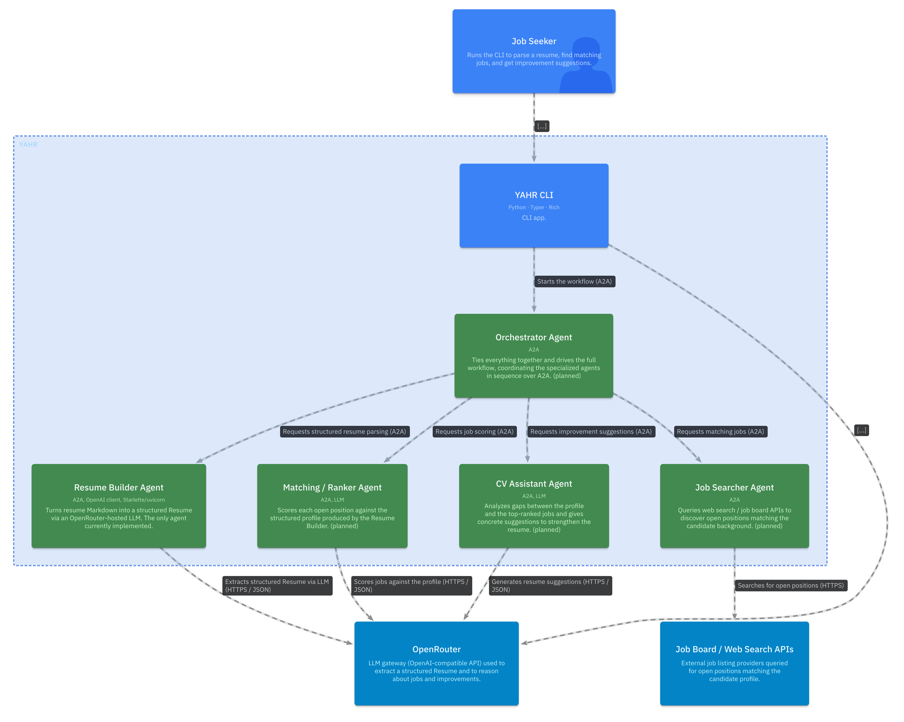
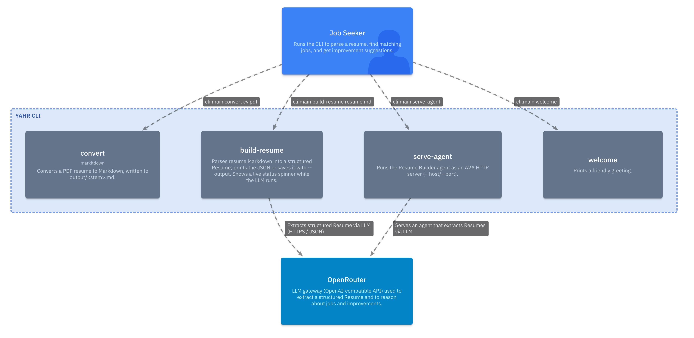

# YAHR


    
Elvis Perlika

elvis.perlika@studio.unibo.it

# Abstract

YAHR (Yet Another HR) is a command-line career co-pilot that automates the
job-search workflow end to end. Starting from a resume in PDF form, it
converts the document to a structured profile, searches for relevant open
positions, scores each listing against the candidate's background, and
returns concrete suggestions for improving the resume to maximize the
chances of landing an interview — all from the terminal.

The system is built on the A2A (Agent-to-Agent) protocol, an open standard
for inter-agent communication, and is organized as a set of specialized
agents coordinated by a single orchestrator: a Resume Builder that parses the
CV into a structured representation, a Job Searcher that queries external
APIs for openings, a Ranker that matches and scores those openings against
the profile, and a CV Assistant that identifies gaps and proposes targeted
improvements. This report describes the motivation, architecture, and
implementation of YAHR, with particular attention to how the A2A protocol
enables a modular, loosely coupled multi-agent design.

# Domain

The diagram above is the *System Context*: a single **Job Seeker** interacts
with **YAHR** from the terminal, while YAHR depends on two external systems —
**OpenRouter** (an OpenAI-compatible LLM gateway) for all language-model
reasoning, and the external **Job Board / Web Search APIs** that supply open
positions.

# Design

Internally YAHR is a multi-agent system built on the **A2A (Agent-to-Agent)
protocol**. A thin **CLI** (the user's entry point) hands work to an
**Orchestrator Agent**, which coordinates four specialized agents in sequence:

- **Resume Builder Agent** — converts resume Markdown into a structured
  `Resume` object via an OpenRouter-hosted LLM. *(implemented)*
- **Job Searcher Agent** — queries the external job/search APIs for openings
  that match the candidate's background. *(planned)*
- **Ranker Agent** — scores each open position against the structured profile.
  *(planned)*
- **CV Assistant Agent** — analyzes the gaps between the profile and the
  top-ranked jobs and proposes concrete resume improvements. *(planned)*

Each agent is a self-contained A2A service exposing its own *agent card* and
skills, which keeps the design modular and loosely coupled: agents can be
developed, deployed, and replaced independently, and the orchestrator depends
only on their public A2A contracts rather than their internals.

The end-to-end data flow is: **PDF → Markdown** (via `markitdown`) **→
structured `Resume`** (Resume Builder + LLM) **→ matching jobs** (Job Searcher)
**→ ranked shortlist** (Ranker) **→ improvement suggestions** (CV Assistant).

The container-level view of the agents and their dependencies is maintained in
`docs/c4/YAHR.c4` (System Context + Containers) and `docs/c4/CLI.c4` (the CLI
commands).

## System Context Diagram


## Container Diagram



## Component Diagram

### CLI Architecture



The CLI is
organized as a thin core that owns the shared application object and output
streams, surrounded by a set of independent commands that each register
themselves on that core when loaded. Adding a command is therefore purely
additive — no central dispatch table to edit — which keeps the surface modular
and easy to extend.

Functionally the commands fall into two groups. *Local* commands handle the
work that needs no model: converting a PDF resume to Markdown, configuring
OpenRouter credentials, and basic UX. *Agent-backed* commands bridge the CLI to
the multi-agent system — turning resume Markdown into a structured `Resume`, and
serving the Resume Builder as an A2A endpoint — and are the only ones that reach
out to OpenRouter for LLM reasoning. This mirrors the system at large: the CLI
stays a lightweight front end, delegating the heavyweight reasoning to the
agents behind it.

## Code Diagram

# Tech Stack

| Area           | Choice                                                        |
| -------------- | ------------------------------------------------------------- |
| Language       | Python 3.14 (local `.venv/`)                                  |
| Agent protocol | `a2a-sdk` (the protobuf-based `a2a` package)                  |
| LLM access     | `openai` client pointed at OpenRouter via a custom `base_url` |
| PDF parsing    | `markitdown` (PDF → Markdown)                                 |
| CLI / output   | `typer` + `rich`                                              |
| HTTP serving   | `starlette` / `uvicorn` / `sse-starlette` (A2A endpoint)      |
| Tooling        | `ruff`, `autoflake`, `nbqa`                                   |

Runtime dependencies are pinned in `requirements.txt`.

# Code

The repository is organized around agents and a CLI:

- `agents/resume_builder/` — the implemented A2A agent:
  - `core.py` — transport-agnostic logic (Markdown → `Resume`).
  - `config.py` — OpenRouter settings from the environment
    (`API_KEY`, `MODEL`, `BASE_URL`).
  - `executor.py` — the A2A `AgentExecutor`; emits the `Resume` as a JSON
    data artifact named `resume`.
  - `agent_card.py` — the public `AgentCard` (skill `build_resume`).
  - `server.py` — assembles the JSON-RPC / agent-card routes into a Starlette
    app served with uvicorn.
- `cli/` — the Typer + Rich CLI; commands live in `cli/commands/` and
  self-register from `cli.app`. Entry point: `python -m cli.main`.
- `agents/job_searcher.py`, `agents/ranker.py`, `agents/orchestrator.py` —
  planned agents.

Key CLI commands:

```bash
yahr convert path/to/cv.pdf        # PDF -> output/<stem>.md
yahr build-resume output/resume.md # Markdown -> structured Resume JSON
yahr serve-agent --port 8001       # run the Resume Builder as an A2A server
```

# Testing

Tests live in `tests/` and run standalone (a tiny built-in runner stands in
for `pytest`, so no extra dependency is required) or under `pytest` if it is
installed:

```bash
PYTHONPATH=. python tests/test_resume_builder.py
```

# Deployment

The Resume Builder agent is deployed as an A2A HTTP service (Starlette served
by uvicorn), exposing JSON-RPC and agent-card endpoints:

```bash
yahr serve-agent --host 127.0.0.1 --port 8001
```

The CLI itself runs locally against a Python 3.14 virtual environment.

# Conclusion


# Changelog

- **2026-06-07** — Documented the multi-agent architecture: expanded the C4
  model with a *Containers* view of the four agents (`docs/c4/YAHR.c4`) and
  filled in the Design, Tech Stack, Code, Testing, and Deployment sections of
  this report to match the codebase. Clarified which agents are implemented
  (Resume Builder) versus planned.