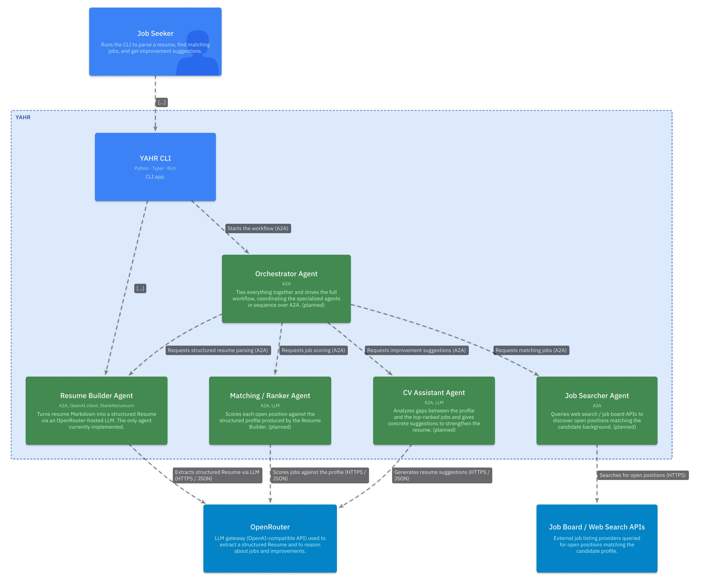
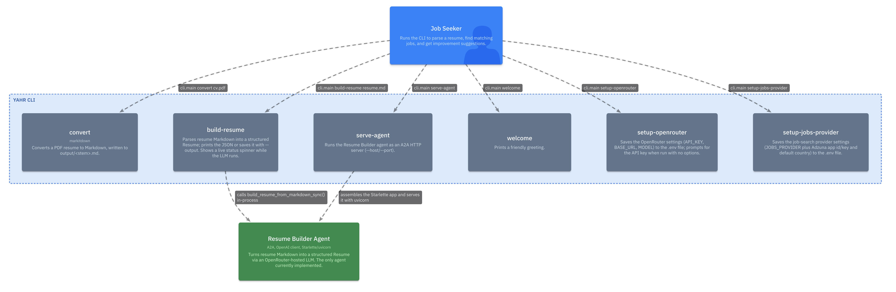

# YAHR


    
Elvis Perlika

elvis.perlika@studio.unibo.it

# Abstract

YAHR (Yet Another HR) is a command-line career co-pilot that automates the
job-search workflow end to end. Starting from a resume in PDF form, it
converts the document to a structured profile, searches for relevant open
positions, scores each listing against the candidate's background, and
returns concrete suggestions for improving the resume to maximize the
chances of landing an interview — all from the terminal.

The system is built on the A2A (Agent-to-Agent) protocol, an open standard
for inter-agent communication, and is organized as a set of specialized
agents coordinated by a single orchestrator: a Resume Builder that parses the
CV into a structured representation, a Job Searcher that queries external
APIs for openings, a Ranker that matches and scores those openings against
the profile, and a CV Assistant that identifies gaps and proposes targeted
improvements. This report describes the motivation, architecture, and
implementation of YAHR, with particular attention to how the A2A protocol
enables a modular, loosely coupled multi-agent design.

# Domain


The diagram above is the *System Context*: a single **Job Seeker** interacts
with **YAHR** from the terminal, while YAHR depends on two external systems —
**OpenRouter** (an OpenAI-compatible LLM gateway) for all language-model
reasoning, and the external **Job Board / Web Search APIs** that supply open
positions.

# Design

Internally YAHR is a multi-agent system built on the **A2A (Agent-to-Agent)
protocol**. A thin **CLI** (the user's entry point) hands work to an
**Orchestrator Agent**, which coordinates four specialized agents in sequence:

- **Resume Builder Agent** — converts resume Markdown into a structured
  `Resume` object via an OpenRouter-hosted LLM. *(implemented)*
- **Job Searcher Agent** — queries the external job/search APIs for openings
  that match the candidate's background. *(in progress: the search layer is
  implemented, the A2A wrapper is not yet)*
- **Ranker Agent** — scores each open position against the structured profile.
  *(planned)*
- **CV Assistant Agent** — analyzes the gaps between the profile and the
  top-ranked jobs and proposes concrete resume improvements. *(planned)*



Each agent is a self-contained A2A service exposing its own *agent card* and
skills, which keeps the design modular and loosely coupled: agents can be
developed, deployed, and replaced independently, and the orchestrator depends
only on their public A2A contracts rather than their internals.

The same decoupling principle is applied one level down, inside the Job
Searcher: job boards are reached through a provider-agnostic interface that
turns a query into a list of *normalized* job postings, so the rest of the
system never knows which backend produced them. The first concrete provider
targets **Adzuna**, a job aggregator covering many countries behind a simple
JSON API; further providers can be added without touching the ranker or the
orchestrator.

The end-to-end data flow is: **PDF → Markdown** (via `markitdown`) **→
structured `Resume`** (Resume Builder + LLM) **→ matching jobs** (Job Searcher)
**→ ranked shortlist** (Ranker) **→ improvement suggestions** (CV Assistant).

### CLI Architecture



The CLI is
organized as a thin core that owns the shared application object and output
streams, surrounded by a set of independent commands that each register
themselves on that core when loaded. Adding a command is therefore purely
additive — no central dispatch table to edit — which keeps the surface modular
and easy to extend. The package is installable (`pip install -e .`), which
exposes the whole app as a single `yahr` executable; invoked with no arguments
it greets the user with its own help screen.

Functionally the commands fall into two groups. *Local* commands handle the
work that needs no model: converting a PDF resume to Markdown, configuring
credentials — for OpenRouter and for the job-search provider — and basic UX.
*Agent-backed* commands bridge the CLI to the multi-agent system — turning
resume Markdown into a structured `Resume`, and serving the Resume Builder as
an A2A endpoint — and are the only ones that reach out to OpenRouter for LLM
reasoning. This mirrors the system at large: the CLI stays a lightweight front
end, delegating the heavyweight reasoning to the agents behind it.

All configuration converges on a single project-local `.env` file: the two
`setup-*` commands share one helper that inserts or updates `key=value` lines
in place, prompting interactively for secrets when no option is given, and the
agents read the same file back at startup. The user never has to edit the file
by hand, and credentials stay out of the shell history and the repository.

### Resume Builder Agent

TODO

### Job Searcher Agent

TODO

### Matching/Ranker Agent

TODO

### CV Assistant Agent

TODO

### Orchestrator Agent

TODO

# Tech Stack

| Area           | Choice                                                        |
| -------------- | ------------------------------------------------------------- |
| Language       | Python 3.14 (local `.venv/`)                                  |
| Agent protocol | `a2a-sdk` (the protobuf-based `a2a` package)                  |
| LLM access     | `openai` client pointed at OpenRouter via a custom `base_url` |
| Job search     | `httpx` (async client for the Adzuna JSON API)                |
| Configuration  | `python-dotenv` (project-local `.env` file)                   |
| PDF parsing    | `markitdown` (PDF → Markdown)                                 |
| CLI / output   | `typer` + `rich`                                              |
| HTTP serving   | `starlette` / `uvicorn` / `sse-starlette` (A2A endpoint)      |
| Tooling        | `ruff`, `autoflake`, `nbqa`                                   |

Runtime dependencies are pinned in `requirements.txt`; the project is also
packaged via `pyproject.toml`, which installs the CLI as the `yahr` console
command.

# Code

The repository is organized around two top-level packages, `agents/` and
`cli/`, mirroring the split between the multi-agent core and its front end.

**Resume Builder** (`agents/resume_builder/`) is the fully implemented A2A
agent. Its code keeps the transport separate from the logic: a
transport-agnostic core turns resume Markdown into a structured `Resume`
through the OpenRouter-hosted LLM, while a thin A2A layer around it — the
executor, the public agent card (skill `build_resume`), and the
Starlette/uvicorn server — exposes that same logic as a network service that
emits the `Resume` as a JSON data artifact. Its OpenRouter settings
(`API_KEY`, `MODEL`, `BASE_URL`) are read from the environment / `.env` file.

**Job Searcher** (`agents/job_searcher/`) currently provides the search layer
the future agent will wrap: an abstract `JobProvider` interface whose single
`search` operation returns normalized `JobPosting` records (title, company,
location, salary range, contract type, …), and a concrete `AdzunaProvider`
that implements it against the Adzuna API over async HTTP. Its credentials
(`ADZUNA_APP_ID`, `ADZUNA_APP_KEY`, optional `ADZUNA_COUNTRY`) follow the same
environment / `.env` convention. The Ranker and Orchestrator agents remain to
be written.

**CLI** (`cli/`) is the Typer + Rich front end described in the Design
section: commands live in `cli/commands/` and self-register on the shared app
from `cli.app`. It runs either as the installed `yahr` command or as
`python -m cli.main`:

```bash
yahr                                  # no args: shows the help screen
yahr setup-openrouter                 # save API_KEY/BASE_URL/MODEL to .env
yahr setup-jobs-provider              # save JOBS_PROVIDER + Adzuna creds to .env
yahr convert path/to/cv.pdf           # PDF -> <stem>.md next to the PDF
yahr convert path/to/cv.pdf -o out/   # ... or into a chosen directory
yahr build-resume output/resume.md    # Markdown -> structured Resume JSON
yahr serve-agent --port 8001          # run the Resume Builder as an A2A server
```

# Testing

Tests live in `tests/` and run standalone (a tiny built-in runner stands in
for `pytest`, so no extra dependency is required) or under `pytest` if it is
installed:

```bash
PYTHONPATH=. python tests/test_resume_builder.py
```

# Deployment

YAHR is installed locally into a Python 3.14 virtual environment
(`pip install -e .`), which puts the `yahr` command on the path. First-time
configuration is done once through the CLI itself — `yahr setup-openrouter`
and `yahr setup-jobs-provider` write the LLM and job-provider credentials to
the project's `.env` file, which every component reads at startup.

The Resume Builder agent is deployed as an A2A HTTP service (Starlette served
by uvicorn), exposing JSON-RPC and agent-card endpoints:

```bash
yahr serve-agent --host 127.0.0.1 --port 8001
```

# Conclusion

# Changelog

- **2026-06-12** — Caught the report up with the latest development round:
  documented the Job Searcher's new provider layer (the `JobProvider`
  interface, normalized `JobPosting`, and the Adzuna backend) and marked the
  agent *in progress*; described the `.env`-based configuration flow and the
  `setup-openrouter` / `setup-jobs-provider` commands; noted the packaging via
  `pyproject.toml` and the `yahr` entry point, the `convert --output` option,
  and the new Code-level C4 views in `docs/c4/CLI.c4` (filled in the Code
  Diagram section accordingly). Added `httpx` and `python-dotenv` to the tech
  stack.
- **2026-06-07** — Documented the multi-agent architecture: expanded the C4
  model with a *Containers* view of the four agents (`docs/c4/YAHR.c4`) and
  filled in the Design, Tech Stack, Code, Testing, and Deployment sections of
  this report to match the codebase. Clarified which agents are implemented
  (Resume Builder) versus planned.